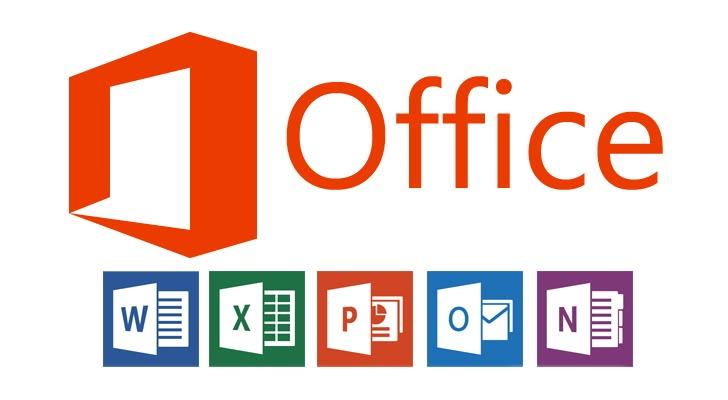
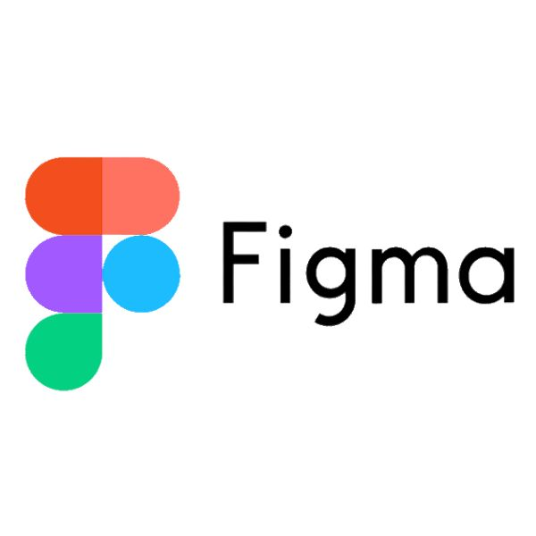

 

  

Hi I’m Kamesh 👋👋

Aspiring Product Manager | Strategy | User Insights | Roadmaps

  
  

  

## 🔧 What I Work On
Strategy & Research | User-Centric Products | Bridging Needs & Goals | Roadmapping & Prioritization | Cross-Functional Collaboration | Strategic Decision-Making | Delivering Measurable Impact  

---

## ❤️ Favorite Products

  
  
  
  

Entertainment | Streaming | Gaming | Community

---

## 🛠 Skills & Tools

  
  
  
  
  

Collaboration | Data Visualization | Analysis | Organization | Design

---

## 📚 Learning & Growth

User Research | Data-Driven Decision Making | Roadmapping & Prioritization | Cross-Functional Leadership | AI in Product Management | Empathy | Analytics | Execution

---

## 📫 Let’s Connect
- LinkedIn: [https://www.linkedin.com/in/kamesh-murty/)]  
- Email: [kameshmurty23@gmail.com]  
